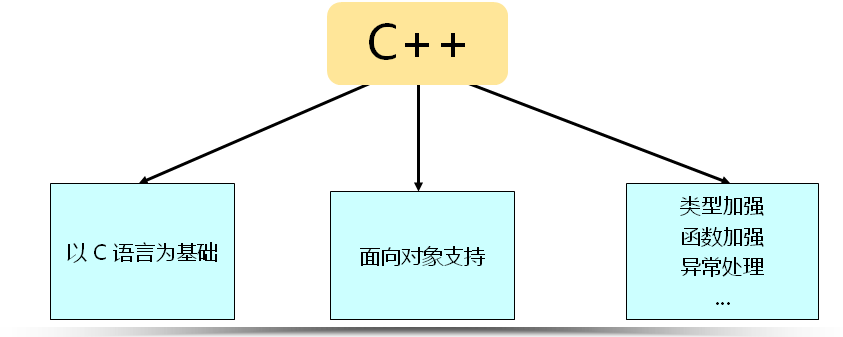
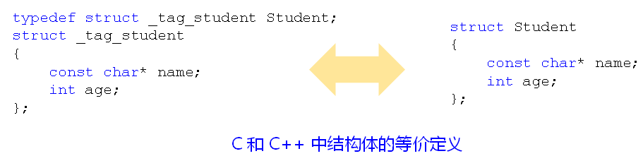

## 一.c和c++的关系

### 1.C++继承了C语言

C语言和C++语言不是技术竞争的关系，反而可以说，C语言和c++语言之间没有任何的竞争关系， C++语言是C语言的后代。 C++是一种进化之后得到的更好的C语言，它们之间是进化的关系。

- C++天生就继承了C语言所有的语言特性
- C++在 C 的基础上提供了更多的语法和特性，变的更强大了
- C++的设计目标是运行效率与开发效率的统一

### 2.c++中后面的两个“+”的含义 

这两个“+”非常好理解，也就是它的字面意思：C语言加上一些新的特性以后得到了一门新的语言，叫做c++语言，这是它的字面特性。其实c++在C语言的基础上它的升级和进化不止两个加号，但为什么我们只写出两个加号呢？c++在C语言的基础上进行的升级最重要的是两个方面:

- 第一个方面是类型的加强，也就是说C++语言比起C语言更可以称得上是高级语言，C语言号称是高级语言，但是它仍旧带了很多低级语言的特性，C++语言更高级了，高级在它的类型上面，C++对于类型的检查是非常严格的。

- 第二个方面就是面向对象的支持，这一点是非常重要的，C++语言天生就支持了面向对象的思想，内置支持面向对象方法学，这一点是c语言无法比拟的。



## 二.c到c++的升级举例

### 1.C++更强调语言的实用性，所有的变量都可以在需要使用时再定义

而C 语言中的变量都必须在作用域开始的位置定义（注：在c99标准中 c语言的变量也可以在需要使用 时再定义）

```c++
#include <stdio.h>
int main(int argc, char *argv[])
{
    printf("Begin...\n");
    /* c++中变量定义可以不在main的起始位置 */
    int c = 0;

    /* c++中可以在for循环中定义变量 */
    for(int i=1; i<=3; i++)
    {
        for(int j=1; j<=3; j++)
        {
            c += i * j;
        }
    }
    printf("c = %d\n", c);
    
    printf("End...\n");
    return 0;
}
```

### 2.register关键字

- register`关键字`请求`编译器将`局部变量存储于寄存器中

- 在C++中依然支持`register`关键字

- C++编译器有自己的优化方式
    - C语言中`无法获取`register变量的地址

    - C++中`可以取得`register`变量的地址

**分析：**

>register关键字仅仅是一个请求，请求编译器做事，因此编译器完全可以拒绝，register虽然看上去对于提高效率很重要，但是在c语言中实际上很鸡肋，因为编译器发展到后期，编译器本身就会做优化了，也许你不写register关键字，编译器仍然会将一个变量存储到一个寄存器当中 。
>  
c++中依然支持register关键字，但仅仅是为了兼容C语言，它有自己的优化方式，可以这么说：在c++编译器中基本上是不会看register的存在的。但还是有一些和C语言不一样的地方：c++可以获取寄存器变量的地址。  

```c++
#include <stdio.h>
int main(int argc, char *argv[])
{
    /**
     * c++中对register变量取地址合法，对register取地址之后，register会失效，
     * 因为编译器知道不可能取得寄存器的地址，因为地址都是针对内存来说的，不是针对寄存器来说的 
     */
    register int a = 0;
    printf("&a = %p\n", &a);
    return 0;
}
```

### 3.定义多个同名的全局变量

- 在C语言中，重复`定义多个同名的全局变量是合法的`
- C语言中多个同名的全局变量最终会被连接到全局数据区的同一个地址空间上
- 在C++中，`不允许定义多个同名的全局变量`,C++直接拒绝这种二义性的做法

```c++
/**
 * 这个实验可以使用gcc编译通过，而g++编译不过
 */
#include <stdio.h>
int g_v;
int g_v;

int main(int argc, char *argv[])
{   
    return 0;
}
```

### 4.struct关键字的加强

- C语言中的struct定义了`一组变量的集合`
- C语言中struct定义的标识符`并不是一种新的类型`
- C++中的struct`用于定义一个全新的类型`



```c++
#include <stdio.h>
/**
 * c语言中struct定义了一组变量的集合，并不是一种新的类型。 
 * c++中struct用于定义一种全新的类型
 */
struct Student 
{
    const char* name;
    int age;
};

int main(int argc, char *argv[])
{
    /* Student类型可以直接用来定义变量 */
    Student s1 = {"Marika", 15};
    Student s2 = {"Sayuri", 15};

    return 0;
}
```

### 5.C++中所有的标识符都必须显式的声明类型

C++对于类型的检查是更严格的，C++中所有`标识符都必须显式的声明类型`，c语言中的`默认类型在C++中是不合法的`

#### 5.1下面的代码中函数f的返回值和参数分别是什么类型？函数g可以接受多少个参数？

```c++
f(i)
{
	printf("i = %d\n", i);
}
g()
{
	return 5;
}
```

分析：

> 在C语言中没有给出参数类型和返回值默认为int  如：f(i) 等价于int f(int i)  
>
> 在C语言中g()中没有给出函数参数表示可以接受任意多个参数

#### 5.2问题：int f()与int f(void)有区别吗？如果有区别是什么？

**分析：**

在c语言中

> `int f()`表示返回值为`int`可以接受任意多个参数  
> `int f(void)`表示返回值为`int`，参数为空  

在C++中
>int f() 和 int f(void)两者没有区别，都是返回值为`int`，参数为空。因为C++中所有的标识符都必须显式的声明类型

```c++
#include <stdio.h>
/**
 * 这个实验可以使用gcc编译通过，而g++编译不过
 */
f(i) 
{
    printf("i = %d\n", i);
}

g()         //c++中必须声明函数返回类型，函数形参不声明则为void 
{           //C语言中，函数变量和形参不声明则都为int，且参数可以接受任意多个
    return 5;
}


int main(int argc, char *argv[])
{
    f(10);
    printf("g() = %d\n", g(1,2,3,4,5));
    return 0;
}
```

## 三.总结

- c++更`强调实用性`，可以在`任何的地方声明变量`
- c++中的`regiser`只是一个`兼容的作用`
- c++编译器能够`更好的进行优化`
- C++中`任意标识都必须显式的指明类型`