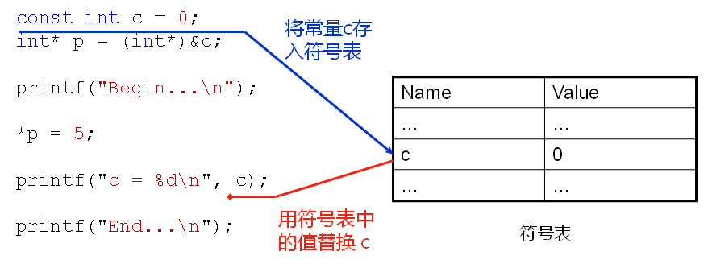

## 1.c语言中的const

- const`修饰的变量是`只读的，`本质还是变量`
- const`修饰的`局部变量在栈上分配空间
- const`修饰的`全局变量在只读存储区分配空间
- const`只在`编译期有用，在`运行期无用`
- `const`修饰的变量不是真的常量，它只是告诉编译器该变量不能出现在赋值符号的左边

**也就是说：**

> C语言中的`const`使得变量具有`只读属性`，const不能定义真正意义上的常量！

**C语言可以定义真正意义上的常量吗？**

> const是不可以的，C语言真正意义上的常量只有枚举

## 2.const编程实验：

编写代码：

```c++
#include <stdio.h>

int main()
{
    const int c = 0;
    int* p = (int*)&c;
    
    printf("Begin...\n");
    
    *p = 5;
    
    printf("c = %d\n", c);
    
    printf("End...\n");
    return 0;
}
```

使用gcc编译并运行

```shell
$ ./a.out 
Begin...
c = 5
End...
```

使用g++编译并运行

```shell
$ ./a.out 
Begin...
c = 0
End...
```

同一个程序，使用C语言编译器和C++编译器编译的程序执行结果是不同的，这个实验说明C语言和c++中的const是不同的

## 3.C++中的const

- C++在C的基础上对const进行了进化处理

- 当碰上const声明式`在符号表中放入常量`

- 编译过程中若发现使用常量则`直接以符号表中的值替换`

- 编译过程中若发现下述情况则给对应的常量`分配存储空间`
    - 对`const`常量使用了`extern`
    - 对`const`常量使用了`&`操作符

**注意：**

> c++编译器虽然可以为const常量分配空间，但不会使用存储空间中的值，这么做目的是为了兼容c语言，兼容就是能通过c语言编译器编译的程序，c++编译器也能编译通过。  

**实例分析：**



>1. 符号表是编译器在编译过程中产生的一张表。  
> 
>2. 编译器编译到 `const int c = 0;`这一行的时候，发现c是一个常量，它的初始值为0，于是将它放到符号表中。  
> 
>3. 当编译器编译到` int *p = (int*)&c;`这一行时，发现使用取地址符&作用于c，于是编译器就要给c分配四个字节的空间，虽然分配了空间，这里并不使用这个空间。  
> 
>4. 编译到`*p = 5;`这一行时，改变的就是为c分配的空间中的值。  
> 
>5. 而编译到printf("c = %d\n", c);时，编译器从符号表中取出c的值放到这里，而并不会使用为c分配的空间中的值。  
> 
>6. 所以我们看到的实验结果是c依旧为0。  

**C/C++中的const对比：**

语言中的const变量:

> C语言中的const变量是`只读变量`，会`分配存储空间`  

C++中的const常量:

> 可能分配存储空间
> 	当`const`常量为全局，并且`需要在其他文件中使用`
> 	当使用`&`操作符对`const`常量取地址

## 4.const与宏

C++中的const常量`类似`于宏定义

> const int  c = 5;  ==> #define  c 5

C++中的const常量`与宏定义不同`

- const常量是由`编译器处理`,编译器对cons常量进行`类型检查`和`作用域检查`

- 宏定义由`预处理器处理`，单纯的文本替换

    ```c++
    #include <stdio.h>
    
    void f()
    {
        #define a 3
        const int b = 4;
    }
    
    void g()
    {
        /**
         * a只是预处理阶段简单的文本替换，编译器不知道a的存在
         * a只是简单的文本替换，没有作用域的，所以从g()中可以访问f()中定义的宏
         */
        printf("a = %d\n", a);
    
        /**
         * b在C语言中是局部只读变量，在c++中是局部常量，所以都不能编译通过
         */
        printf("b = %d\n", b);
    }
    
    int main()
    {
    
        const int A = 1;
        const int B = 2;
    
        /**
         * A和B在C语言中是只读变量，A+B的结果需要在运行时才可以知道，所以使用gcc编译不通过。
         * 在C++中const修饰的是真正的常量，所以使用g++编译通过
         */
        int array[A + B] = {0};
    
        int i = 0;
        
        for(i=0; i<(A + B); i++)
        {
            printf("array[%d] = %d\n", i, array[i]);
        }
        
        f();
        g();
        
        return 0;
    }
    ```

-   [x] 注意

这一节当中使用了const 常量确定数组大小，而在c++中是可以使用变量定义数组的大小，（只是不能初始化，否则编译不过）。例如：

```c++
int main()
{
    int A = 1;
    int B = 2;
    int array[A + B];
    return 0;
}
```


## 5.总结

- 与C语言不同，C++中的const`不是只读变量`

- C++中的const是一个`真正意义上的常量`

- C++编译器`可能`会为const常量分配空间

- C++`完全兼容`C语言中const常量的`语法特性`