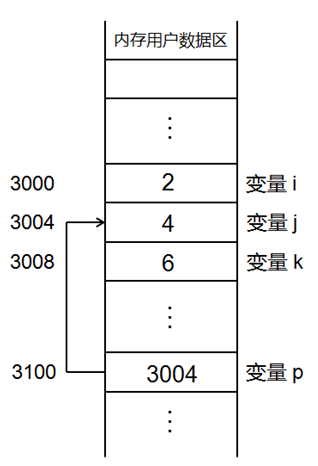

## 1.布尔类型

- C++在C语言的基本类型系统之上增加了bool
- C++的bool可取的值只有`true`和`false`
- 理论上bool只占用`一个字节`

**注意：**

- true代表`真值`，编译器内部用`1`来表示
- false代表`非真值`，编译器内部用`0`来表示

**编程实验：**

bool类型只有true（非0）和false（0）两个值

C++编译器会将非0值转换为true，0值转换为false

那么下面的代码输出什么？

```c++
bool b = 0;
printf("b = %d\n", b);//0
b++;
printf("b = %d\n", b);//1
b = b -3;//布尔类型支持数学运算吗？
printf("b = %d\n", b);//1
```

分析：

c++编译器在碰到布尔类型参与运算的时候，将布尔类型当做只占用一个字节的整形数来处理，但会将最终的结果进行转换，将非0只用true来代替，将0值用false代替

【实例4-1】

```c++
#include <stdio.h>

int main(int argc, char *argv[])
{
    bool b = false;
    int a = b;
    
    printf("sizeof(b) = %d\n", sizeof(b));//1
    printf("b = %d, a = %d\n", b, a);//0,0
    
    b = 3;
    a = b;
    
    printf("b = %d, a = %d\n", b, a);//1,1
    
    b = -5;
    a = b;
    
    printf("b = %d, a = %d\n", b, a);//1,1
    
    a = 10;
    b = a;
    
    printf("a = %d, b = %d\n", a, b);//10,1
    
    a = 0;
    b = a;
    
    printf("a = %d, b = %d\n", a, b);//0,0
    
    return 0;
}

```

布尔类型是C++中的基本数据类型

- 可以定义bool类型的`全局变量`
- 可以定义bool类型的`常量`
- 可以定义bool类型的`指针`
- 可以定义bool科学的`数组`

## 2.三目运算符

### 2.1下面的代码正确吗？

```c++
int a = 1;
int b = 2;
(a<b?a:b) = 3;
printf("a = %d, b = %d\n", a, b);
```

分析：

- 在c语言中这段代码不正确，左边是一个值，不能把3赋给一个值。
- 在C++中这段代码是正确的。

### 2.2C++对三目运算符进行了升级

c语言中的三目运算符返回的是`变量值`

> 不能作为左值使用

C++中的三目运算符可直接返回`变量本身`

> 既可以作为`右值`使用，也可作为`左值`使用

注意：

> 三门运算符可能返回的值中如果有一个是常量值，则不能作为左值使用

2.3c++对三目运算符做了怎样的升级？这种升级的意义是什么？

## **3.引用**

变量名回顾

- 变量`是一段实际连续`存储空间的别名

- 程序中通过`变量`来申请并`命名存储空间`

- 通过`变量`的名字可以使用存储空间




问题：

一段连续的存储空间只能由一个别名吗？

C++中的引用

在c++中新增了引用的概念

引用可以看做一个已经定义变量的别名

引用的语法：Type& name = var;

```c++
int a = 4;
int & b = a; //b为a的别名

b = 5;
```

注意：

普通引用在定义时必须用`同类型的变量`进行初始化

【实例4-2】

```c++
#include <stdio.h>

int main(int argc, char *argv[])
{
    int a = 4;
    int& b = a;
    
    b = 5;
    
    printf("a = %d\n", a);
    printf("b = %d\n", b);
    printf("&a = %p\n", &a);
    printf("&b = %p\n", &b);
    
    return 0;
}
c
```


分析：

对b进行操作，a的值也发生了相同的改变，也就是通过a这个变量的别名b，对a这个变量进行了修改，操作b就等于操作a。

打印a和b的地址，发现它们的地址相同，说明在C++中可以对同一段连续的内存起任意多的别名

我的理解：引用类型相当于linux中的硬连接

三个修改 31分钟

C++对三目运算符做了什么?

当三目运算符的`可能返回都是变量时`，返回的是变量引用

当三目运算符的`可能返回中有常量时`，返回的是值

int a = 1; int b = 2; (a<b?a:b) = 3;//正确，返回a或b的引用 ，可作为左值 (a<b?1:b) = 4;//错误，返回1或b的值，不能作为左值

### 总结

- bool`类型是C++新增加的`基础类型

- bool`类型的值只能是`true`和`false

- C++中的三目运算符`可作为左值使用`

- C++中的`引用可以作为变量的别名来使用`

- 三目运算符的`可能返回都是变量是，返回的是引用`