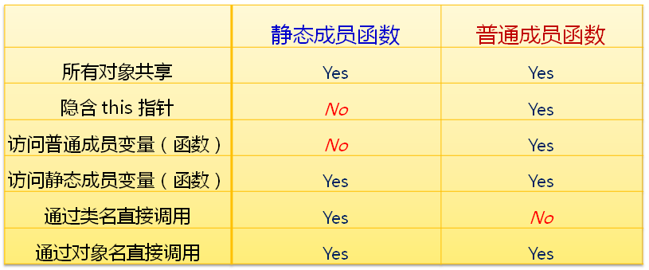

## 1.上一节未完成的需求

**已实现：**

- [x] 统计在程序运行期间某个类的对象数目
- [x] 保证程序的安全性（不能使用全局变量）

**尚未实现：**

- [ ] 随时可以获取当前对象的数目（**failure**）

## 2.问题尝试修正

方案：通过类名直接访问静态成员变量，这样就可以随时可以获取当前对象的数目。

```c++
#include  <stdio.h>
class  Test
{
public:
    static int cCount;
public:
    Test()
    {
        cCount++;
    }

    ~Test()
    {
        --cCount;
    }

    int getCount()
    {
        return cCount;
    }
};

int Test::cCount = 0;

int  main()
{
    printf("count = %d\n", Test::cCount);
    //Test::cCount = 1000;
    printf("count = %d\n", Test::cCount);
    return 0;
}
```

**问题分析：**

- 用户可以随便修改对象的数目（如`Test::cCount = 1000;`），不能保证变量的安全性。

- 这个尝试是不可行的。


**总结需要实现的目标：**

- `不依赖对象`就可以访问静态成员变量

- 必须保证静态成员变量的安全性

- 方便快捷的获取静态成员变量的值


## 3.静态成员函数

### 3.1c++中的静态成员函数

- 静态成员函数是类中`特殊的成员函数`

- 静态成员函数`属于整个类所有`

- 可以`通过类名直接访问`公有静态成员函数

- 可以`通过对象名访问`静态成员函数


### 3.2静态成员函数的定义

直接通过`static`关键字修饰成员函数

```c++
class Test
{
public:
    static void Func1() {}
    static int Func2();
};

int Test::Func2()
{
    return 0;
}
```

### 3.3静态成员函数示例

```c++
#include <stdio.h>

class Demo
{
private:
    int i;
public:
    int getI();
    static void StaticFunc(const char* s);
    static void StaticSetI(Demo& d, int v);
};

int Demo::getI()
{
    return i;
}
/* 用于打印字符串 */
void Demo::StaticFunc(const char* s)
{
    printf("StaticFunc: %s\n", s);
}

/**
 *静态成员函数，没有直接调用变量i，而是通过对象来间接调用变量i，这说明什么呢？
 *说明：静态成员函数不能访问普通成员变量（函数），需通过对象间接访问成员变量（函数）
 */
void Demo::StaticSetI(Demo& d, int v)
{
    /* 通过间接的方式访问成员变量 */
    d.i = v;
}

int main()
{
    Demo::StaticFunc("main Begin...");/* 通过类名访问静态成员函数 */
    
    Demo d;
    
    Demo::StaticSetI(d, 10);
    printf("d.i = %d\n", d.getI());
    
    Demo::StaticFunc("main End...");
    
    return 0;
}
```

### 3.4静态成员函数和普通成员函数的区别



## 4.最后的解决方案

```c++
#include <stdio.h>

class Test
{
private:
    static int cCount;
public:
    Test()
    {
        cCount++;
    }
    ~Test()
    {
        --cCount;
    }
    static int GetCount()
    {
        return cCount;
    }
};

int Test::cCount = 0;

int main()
{
    /* 没有对象时通过类名访问静态成员函数，也可以获取当前对象的数目 */
    printf("count = %d\n", Test::GetCount());
    
    Test t1;
    Test t2;
    
    printf("count = %d\n", t1.GetCount());
    printf("count = %d\n", t2.GetCount());
    
    Test* pt = new Test();
    
    printf("count = %d\n", pt->GetCount());
    
    delete pt;
    
    printf("count = %d\n", Test::GetCount());
    
    return 0;
}

```

## 5.使用static成员函数兼容c函数

在工作过程中，会用到一些c语言实现的函数库，而这些函数的参数要求必须传入静态成员函数的指针。类的普通成员函数会隐含一个this参数，因此需要实例才能调用。只要将某个实例的参数指针或类的this指针传入静态成员函数，就可以很方便的在c++编程中使用c函数完成我们的目标。

例如我们要使用linux下的`pthread_create`函数实现一个简单的线程类：

 Thread.h

```c++
#ifndef _THREAD_H_
#define _THREAD_H_ 
#include <iostream>
#include <string>
#include <pthread.h>

using namespace std;

class Thread
{
private:
    volatile bool isRunning = false; /* 线程运行标志 */
    pthread_t threadID = 0;          /* 线程ID */
    static void* threadProcess(void * arg);
protected:
    virtual void run(void) = 0;      /* 由子类重写run函数 */
public:
    Thread();
    ~Thread();
    bool start(void);
    bool stop(void);
};
#endif
```

 Thread.cpp 

```c++
#include "Thread.h"
Thread::Thread()
{

}

bool Thread::start()
{
    if(isRunning == false)
    {
        /* 注意这里传入了this指针 */
        if(pthread_create(&threadID, NULL, threadProcess, this) != 0)
        {
            cout << __FILE__<<":"<<__LINE__<<" pthread_create failed!" << endl;
            return false;
        }
        isRunning = true;
    }
    return isRunning;
}

bool Thread::stop()
{
    void *thrdRet = NULL;

    if(isRunning)
    {
        isRunning = false;
        pthread_join(threadID, &thrdRet);
    }

    return !isRunning;
}

void * Thread::threadProcess(void * arg)
{
    /* 根据不同的实例指针调用对应的成员函数 */
    Thread * pthis = static_cast<Thread*>(arg);
    pthis->run();
}

Thread::~Thread()
{
    stop();
}
```

main.cpp

```c++
#include "Thread.h"
#include <unistd.h>
class TesetThread :public Thread
{
    void run()
    {
        while(true)
        {
            cout<<"hello"<<endl;
            sleep(1);
        }
    }
};
int main(int argc, const char *argv[])
{
    TesetThread t;
    t.start();
    while(true)
    {
        sleep(1);
    }
    return 0;
}
```

关键是将实例指针传入静态成员函数，这样就可以不依赖静态成员变量完成，而是根据不同的实例指针调用对应的成员函数。

[完整代码在这里查看](https://gitee.com/Q_uan/cpp_learn/tree/71b565a75048ce84ff1fa154522d9846d1d360c7/26_%E7%B1%BB%E7%9A%84%E9%9D%99%E6%80%81%E6%88%90%E5%91%98%E5%87%BD%E6%95%B0/code/Thread)

## 6.总结

- 静态成员函数是类中特殊的成员函数

- 静态成员函数没有隐藏的this参数

- 静态成员函数可以通过类名直接访问

- 静态成员函数只能直接访问静态成员变量（函数）