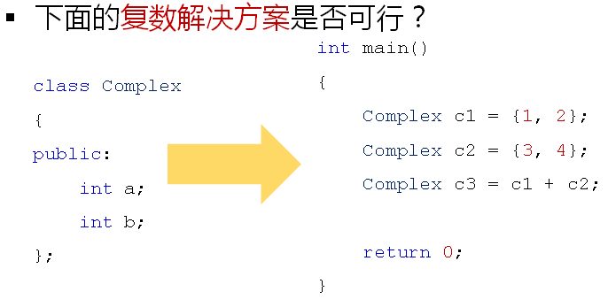

## 1.普通函数重载总结

- 函数重载的`本质为相互独立的不同函数`

- C++中通过`函数名`和`函数参数`确定函数调用

- 无法`直接通过`函数名`得到重载函数的`入口地址

- 函数重载`必然发生在同一个作用域中`


## 2.类中的成员函数重载

**类中函数的重载可以分为三种：**

- 构造函数的重载
- 普通成员函数的重载

- 静态成员函数的重载


**问题：**

> 全局函数、普通成员函数以及静态成员函数之间是否可以构成重载？  

**分析：**

- 重载函数的本质为多个不同的函数
- 函数名和参数列表是唯一标识

- 函数重载必须发生在同一个作用域中

**结论：**

- 普通成员函数和静态成员函数可以构成重载

- 全局函数和成员函数不能构成重载


## 3.重载实验分析

```c++
#include <stdio.h>

class Test
{
    int i;
public:
    Test()
    {
        printf("Test::Test()\n");
        this->i = 0;
    }
    
    Test(int i)
    {
        printf("Test::Test(int i)\n");
        this->i = i;
    }
    
    Test(const Test& obj)
    {
        printf("Test(const Test& obj)\n");
        this->i = obj.i;
    }
    
    static void func()
    {
        printf("void Test::func()\n");
    }
    
    void func(int i)
    {
        printf("void Test::func(int i), i = %d\n", i);
    }
    
    int getI()
    {
        return i;
    }
};

void func()
{
    printf("void func()\n");
}

void func(int i)
{
    printf("void func(int i), i = %d\n", i);
}

int main()
{
    /* 全局函数之间的重载 */
    func();
    func(1);

    /* 构造函数之间的重载 */
    Test t;        // Test::Test()
    Test t1(1);    // Test::Test(int i)
    Test t2(t1);   // Test(const Test& obj)

    /* 全局函数和静态成员函数不构成重载 */
    func();        // void func()
    Test::func();  // void Test::func()
    
    /* 全局函数和普通成员函数不构成重载 */
    func(2);       // void func(int i), i = 2;
    t1.func(2);    // void Test::func(int i), i = 2
    t1.func();     // void Test::func()
    
    return 0;
}
```

## 4.重载的意义

- 通过`函数名`对函数`功能进行提示`

- 通过`参数列表`对函数`用法进行提示`

- `扩展`系统中`已经存在`的函数功能

**编程实验：**

- [x] 通过函数重载扩展strcpy的功能


原函数：

```c++
 char *strcpy(char *dest, const char *src);
```

扩展后带三个参数的拷贝函数：

```c++
 char* strcpy(char *dest, const char *src, unsigned int n);
```

完整测试代码：

```c++
#include <stdio.h>
#include <string.h>

char* strcpy(char* buf, const char* str, unsigned int n)
{
    return strncpy(buf, str, n);
}

int main()
{
    const char* s = "D.T.Software";
    char buf[8] = {0};
    
    //strcpy(buf, s);
    strcpy(buf, s, sizeof(buf)-1);
    
    printf("%s\n", buf);
    
    return 0;
}
```

## 5.函数重载的进一步应用

重载能够扩展系统中已经存在的函数功能，那么重载是否可以扩展其他更多的功能？



答案是可以，下一节中进行详细分析

## 6.总结

- 类的`成员函数`之间可以进行`重载`

- 重载必须`发生在同一个作用域中`

- `全局函数`和`成员函数`不能构成重载关系

- 重载的意义在于`扩展已经存在的功能`