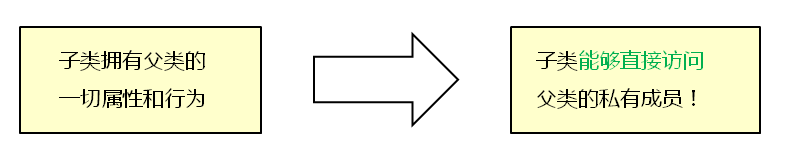
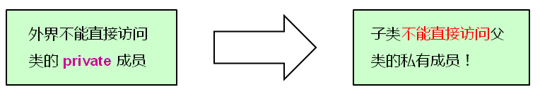
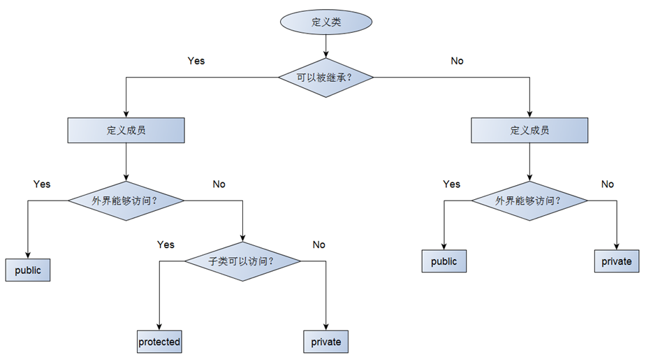
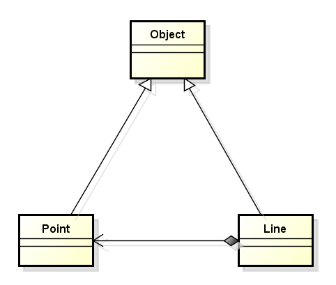

## 1.子类是否可以`直接访问`父类的`私有成员`？

**分析：**

根据面向对象的理论，子类拥有父类的一切属性和行为，因此推测子类`能够直接访问`父类的私有成员



根据c++的语法，外部不能直接访问类的private成员，因此推测子类`不能直接访问`父类的私有成员



从两个角度分析，推测的结果是不同的，下面通过实验来得出真正的结论。

**编程实验：测试子类是否可以访问父类私有成员变量**

```c++
/* 测试子类是否可以访问父类私有成员变量 */
#include <iostream>
#include <string>
using namespace std;
class Parent
{
private:
    int mv;
public:
    Parent()
    {
        mv=100;
    }
    int value()
    {
        return mv;
    }
};
class Child:public Parent 
{
public:
    int addValue(int v)
    {
        mv=mv+v; //can this be ok?
    }
};
int main()
{
    return 0;
}
```

**结果：**

编译不通过，子类不能访问父类的private成员变量。

```shell
$ g++ 44_1.cpp 
44_1.cpp: In member function ‘int Child::addValue(int)’:
44_1.cpp:8:9: error: ‘int Parent::mv’ is private
     int mv;
         ^
44_1.cpp:24:9: error: within this context
         mv=mv+v; //can this be ok?
         ^
44_1.cpp:8:9: error: ‘int Parent::mv’ is private
     int mv;
         ^
44_1.cpp:24:12: error: within this context
         mv=mv+v; //can this be ok?
            ^
```

## 2.继承中的访问级别

- 面对对象的访问级别不只是`public`和`private`
- 可以定义`protected`访问级别
- 关键字protected的意义
    - ​	修饰的成员不能被外界直接访问
    - ​	修饰的成员可以被`子类直接访问`

**编程实验：protected的使用**

```c++
/**
 * 1.测试父类能否在外部访问protected修饰的成员变量
 * 2.测试子类能否在子类内部访问父类中使用protected修饰的成员变量
 * 3.测试子类能否在外部直接访问父类中使用protected修饰的成员变量
 */
#include <iostream>
#include <string>
using namespace std;
class Parent
{
protected:
    int mv;
public:
    Parent()
    {
        mv=100;
    }
    int value()
    {
        return mv;
    }
};
class Child:public Parent 
{
public:
    int addValue(int v)
    {
        mv=mv+v; //can this be ok?
    }
};
int main()
{
    Parent p;
    cout<<"p.mv="<<p.value()<<endl;
    //p.mv=1000; //error  父类不能在外部访问protected修饰的成员变量
    Child c;
    cout<<"c.mv="<<c.value()<<endl;//子类能在子类内部访问父类中使用protected修饰的成员变量
    c.addValue(50);
    cout<<"c.mv="<<c.value()<<endl;
    //c.mv=10000;//error //子类不能在外部直接访问父类中使用protected修饰的成员变量
    return 0;
}
```

## **3.定义类时访问级别的选择**

在定义类是进行按照下图流程确定访问级别



**编程实验：** 组合与继承的综合实例

编写代码实现下图中的类关系，并体现protected关键字的实际意义。下图中有三个类，Point继承Object，Line继承Object，Point和Line是组合关系。



```c++
#include <iostream>
#include <string>
#include <sstream>

using namespace std;

class Object
{
protected:
    string mName;
    string mInfo;
public:
    Object()
    {
        mName = "Object";
        mInfo = "";
    }
    string name()
    {
        return mName;
    }
    string info()
    {
        return mInfo;
    }
};

class Point : public Object
{
private:
    int mX;
    int mY;
public:
    Point(int x = 0, int y = 0)
    {
        ostringstream s;
        
        mX = x;
        mY = y;
        mName = "Point";
        
        s << "P(" << mX << ", " << mY << ")";
        
        mInfo = s.str();
    }
    int x()
    {
        return mX;
    }
    int y()
    {
        return mY;
    }
};

class Line : public Object
{
private:
    Point mP1;
    Point mP2;
public:
    Line(Point p1, Point p2)
    {
        ostringstream s;
        
        mP1 = p1;
        mP2 = p2;
        mName = "Line";
        
        s << "Line from " << mP1.info() << " to " << mP2.info();
        
        mInfo = s.str();
    }
    Point begin()
    {
        return mP1;
    }
    Point end()
    {
        return mP2;
    }
};

int main()
{   
    Object o;
    Point p(1, 2);
    Point pn(5, 6);
    Line l(p, pn);
    
    cout << o.name() << endl;
    cout << o.info() << endl;
    
    cout << endl;
    
    cout << p.name() << endl;
    cout << p.info() << endl;
    
    cout << endl;
    
    cout << l.name() << endl;
    cout << l.info() << endl;
    
    return 0;
}

```

## 4.总结

- 面向对象中的访问级别不只是public和private

- protected修饰的成员不能被外界所访问

- protected使得子类能够访问父类的成员

- protected关键字是为了继承而专门设计的

- 没有protected就无法完成真正意义上的代码复用