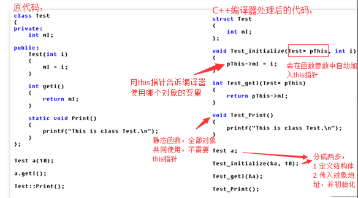
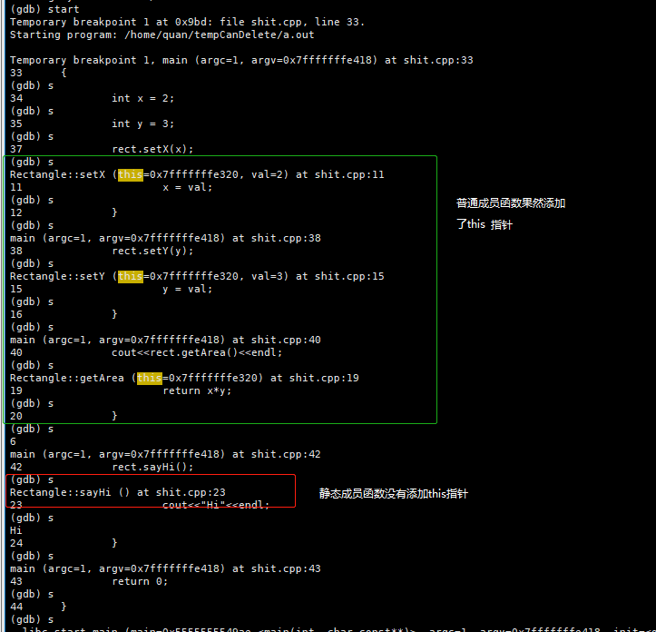

## 1.以C语言的方式模拟编译器对类中成员函数的处理



创建对象的过程可以理解为： Test  t(1,2)=====> Test  (this,1,2)====> Test  (&t,1,2)

参考文档

https://blog.csdn.net/nwd0729/article/details/46790883

## 2.使用gdb观察编译器对类中成员函数的处理

编译下面的测试代码

```c++
#include <iostream>
using namespace std;

class Rectangle
{
    int x;
    int y;
public:
    void setX(int val)
    {
        x = val;
    }
    void setY(int val)
    {
        y = val;
    }
    int getArea()
    {
        return x*y;
    }
    static void sayHi()
    {
        cout<<"Hi"<<endl;
    }
};

void func(int x)
{
    cout<<x<<endl;
}

int main(int argc, const char *argv[])
{
    int x = 2;
    int y = 3;
    Rectangle rect;
    rect.setX(x);
    rect.setY(y);

    cout<<rect.getArea()<<endl;

    rect.sayHi();
    return 0;
}

```

使用gdb单步运行程序，可以看到普通成员函数被添加了this指针，静态成员函数没有添加this指针




