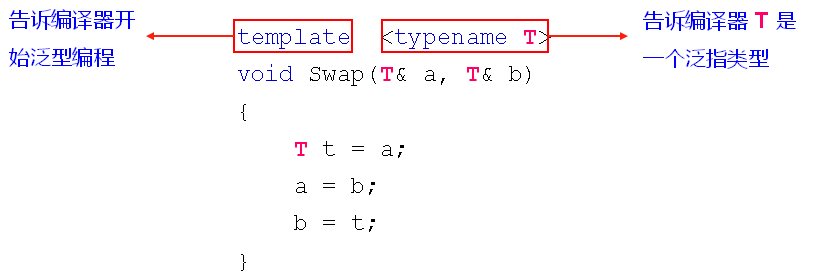

## 1.c++中有几种交换变量的方法?

**定义宏代码块** 

- 优点：代码可复用，适合所有的类型
- 缺点：编译器不知道宏的存在，缺少类型检查

**定义函数**

- 优点：是真正的函数调用，编译器对类型进行检查
- 缺点：根据类型重复定义函数，无法代码复用

**编程实验：[变量的交换](./code/56-1.cpp)**

```c++
#include <iostream>
#include <string>

using namespace std;

#define SWAP(t, a, b)    \
do                       \
{                        \
    t c = a;             \
    a = b;               \
    b = c;               \
}while(0)


void Swap(int& a, int& b)
{
    int c = a;
    a = b;
    b = c;
}

void Swap(double& a, double& b)
{
    double c = a;
    a = b;
    b = c;
}

void Swap(string& a, string& b)
{
    string c = a;
    a = b;
    b = c;
}
void testMacro()
{
    int a = 0;
    int b = 1;
    
    SWAP(int, a, b);
    
    cout << "a = " << a << endl;
    cout << "b = " << b << endl;
    
    double m = 2;
    double n = 3;
    
    SWAP(double, m, n);
    
    cout << "m = " << m << endl;
    cout << "n = " << n << endl;
    
    string d = "Delphi";
    string t = "Tang";
    
    SWAP(string, d, t);
    
    cout << "d = " << d << endl;
    cout << "t = " << t << endl;
}
vid testFunc()
{
    int a = 0;
    int b = 1;
    
    Swap(a, b);
    
    cout << "a = " << a << endl;
    cout << "b = " << b << endl;
    
    double m = 2;
    double n = 3;
    
    Swap(m, n);
    
    cout << "m = " << m << endl;
    cout << "n = " << n << endl;
    
    string d = "Delphi";
    string t = "Tang";
    
    Swap(d, t);
    
    cout << "d = " << d << endl;
}
int main()
{
    testMacro();
    testFunc();
}

```

**思考：**

> c++中有没有解决方案可以集合这两种方法的优点？  

## 2.泛型编程的概念

**概念：不考虑具体数据类型的编程方式**

对于Swap函数可以考虑下面的泛型写法

```c++
void Swap(T& a, T& b)
{
    T t = a;
    a =  b;
    b = t;
}
```

Swap泛型写法中的T不是一个具体的数据类型，而是泛指任意的数据类型。

## 3.c++中的泛型编程之函数模板

### 3.1函数模板介绍

- 一种特殊的函数可用不同类型进行调用
- 看起来和普通函数很相似，区别是类型可被参数化

```c++
template <typename T>
void Swap(T& a, T& b)
{
    T t = a;
    a =  b;
    b = t;
}
```

### 3.2函数模板的语法规则

- **template**关键字用于`声明开始进行泛型编程`
- **typename**关键字用于`声明泛指类型`



### 3.3函数模板的类型推导

函数模板有以下两种使用方式：

- 自动类型推导调用
- 具体类型显示调用

```c++
int a = 0;
int b = 1;
Swap(a, b);//自动推导

float c = 2;
float d = 3;
Swap<float>(c, d);//显示调用
```

### 3.4函数模板实验

**编程实验：[使用函数模板实现一个适合所有类型的选择排序](./code/56-2.cpp)**

```c++
#include <iostream>
#include <string>

using namespace std;

template < typename T >
void Swap(T& a, T& b)
{
    T c = a;
    a = b;
    b = c;
}

template < typename T >
void Sort(T a[], int len)
{
    for(int i=0; i<len; i++)
    {
        for(int j=i; j<len; j++)
        {
            if( a[i] > a[j] )
            {
                Swap(a[i], a[j]);
            }
        }
    }
}

template < typename T >
void Println(T a[], int len)
{
    for(int i=0; i<len; i++)
    {
        cout << a[i] << ", ";
    }
    
    cout << endl;
}

int main()
{
    int a[5] = {5, 3, 2, 4, 1};
    
    Println(a, 5);
    Sort(a, 5);
    Println(a, 5);
    
    string s[5] = {"Java", "C++", "Pascal", "Ruby", "Basic"};
    
    Println(s, 5);
    Sort(s, 5);
    Println(s, 5);
    
    return 0;
}
```

## 4.总结

- 函数模板是`泛型编程`在c++中应用的方式之一
- 函数模板能够`根据实参对参数类型进行推导`
- 函数模板支持`显示的指定参数类型`
- 函数模板是`c++中重要的代码复用方式`