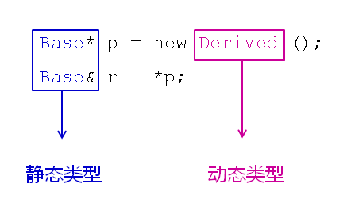

## 1.为什么要提出类型识别的概念？

在面对对象中可能出现下面的情况

- `基类指针`指向子类对象
- `基类引用`成为子类对象的别名



c++中引入了面向对象的特性，面向对象中有一个非常重要的原则：赋值兼容性原则（子类对象可以当做父类对象来使用），因此当我们拿到一个基类类型的指针指向的对象或者基类类型的引用时，无法判断到底是基类还是子类。

### 1.1静态类型和动态类型

- 静态类型-变量（对象）自身的类型
- 动态类型-指针（引用）所指向对象的实际类型
- 基类指针是否可以强制类型转换为子类指针`取决于动态类型`

下面是一个危险的转换示例，因为我们无法知道这样转化是否合法

```c++
void test(Base *b) 
{    
    /* 危险的转换方式 */    
    Dervived* d = static_cast<Derived*>(b); 
}
```

### 1.2 c++中利用多态得到动态类型

**解决方案：**

>1. 在基类中`定义虚函数`返回具体的类型信息  
>2. 所有的派生类都`必须实现`类型相关的虚函数  
>3. 每个类中的类虚函数都`需要不同的实现`  

**实验：多态实现动态类型识别**

```c++
#include <iostream>
#include <string>

using namespace std;

class Base
{
public:
    virtual string type()
    {
        return "Base";
    }
};

class Derived : public Base
{
public:
    string type()
    {
        return "Derived";
    }
    
    void printf()
    {
        cout << "I'm a Derived." << endl;
    }
};

class Child : public Base
{
public:
    string type()
    {
        return "Child";
    }
};

void test(Base* b)
{
    /* 危险的转换方式 */
    // Derived* d = static_cast<Derived*>(b);
    
    if( b->type() == "Derived" )
    {
        Derived* d = static_cast<Derived*>(b);
        
        d->printf();
    }
    
    // cout << dynamic_cast<Derived*>(b) << endl;
}

int main(int argc, char *argv[])
{
    Base b;
    Derived d;
    Child c;
    
    test(&b);
    test(&d);
    test(&c);
    
    return 0;
}
```

### 1.3多态解决方案的缺陷

- 必须从基类开始提供类型虚函数
- 所有的派生类都必须重写类型虚函数
- 每个派生类的类型名必须唯一

## 2.类型识别关键字

- C++提供了typeid关键字用于获取类型信息
- typeid关键字返回对应参数的`类型信息`
- typeid返回一个type_info类对象
- 当typeid的参数为NULL时将抛出异常

**typeid关键字的使用**

```c++
int i = 0; 
const type_info& tiv = typeid(i); 
const type_info& tii = typeid(int); 
cout<<(tiv == tii)<<endl;
```

**typeid的注意事项**

- 当参数为类型时，返回静态类型信息
- 当参数为变量时：
    - 不存在虚函数表-返回静态类型信息
    - 存在虚函数表-返回动态类型信息

**实验：typeid类型识别**

```c++
#include <iostream>
#include <string>
#include <typeinfo>

using namespace std;

class Base
{
public:
    virtual ~Base()
    {
    }
};

class Derived : public Base
{
public:
    void printf()
    {
        cout << "I'm a Derived." << endl;
    }
};

void test(Base* b)
{
    const type_info& tb = typeid(*b);
    
    cout << tb.name() << endl;
}

int main(int argc, char *argv[])
{
    int i = 0;
    
    const type_info& tiv = typeid(i);
    const type_info& tii = typeid(int);
    
    cout << (tiv == tii) << endl;
    
    Base b;
    Derived d;
    
    test(&b);
    test(&d);
    
    return 0;
}
```

### 3.总结

- c++中有`静态类型`和`动态类型`的概念
- 利用`多态`能够实现对象的动态类型识别
- `typeid`是专用于类型识别的关键字
- `typeid`能够返回对象的动态类型信息